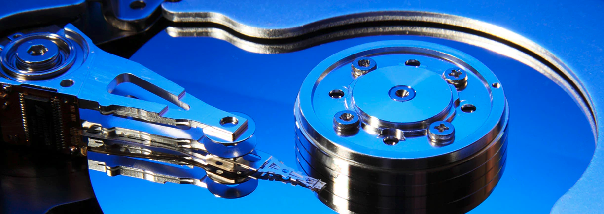
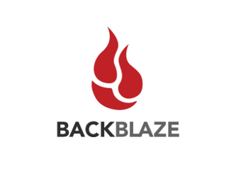
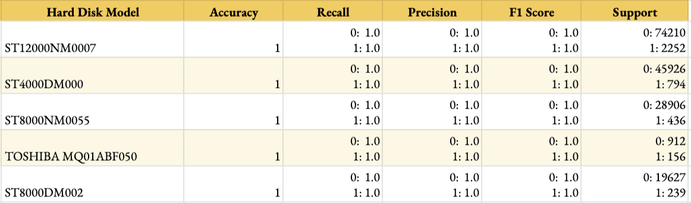
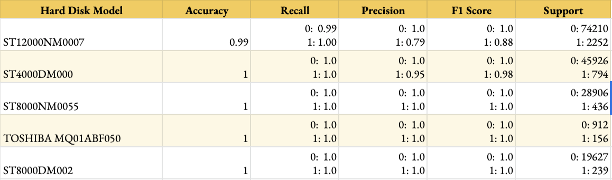
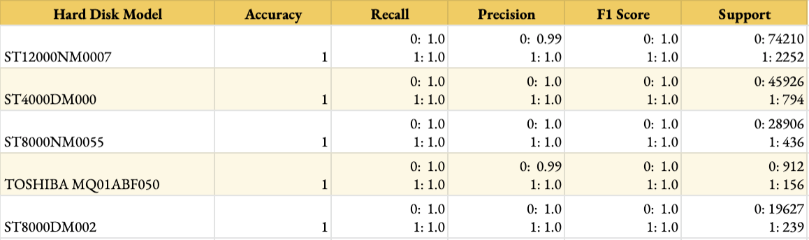

#### CS 7461 Project 21: [Akarshit Wal](https://github.com/Akarshit), [Gnanaguruparan Aishvaryaadevi](https://github.com/Aishvaryaa), [Karthik Nama Anil](https://github.com/KarthikNA), [Parth Tamane](https://github.com/parthv21), [Vaishnavi Kannan](https://github.com/Vaishnavik22)  

    

# Introduction

# Motivation

# Problem Statement

# Dataset

    

# Methodology

    

## Data Cleaning

## Feature Selection

## Unsupervised Learning

## Supervised Learning

# Results

### Random Forest

    

### XG Boost

    

### Isolation Forest

    

# Conclusion

# References

----

Dataset = [Hard Drive Data and Stats - Hard drive failure data and stats from 2019](https://www.kaggle.com/jackywangkaggle/hard-drive-data-and-stats)

Source = [Hard Drive Data and Stats](https://www.backblaze.com/b2/hard-drive-test-data.html)

# Smart Stats List

[List of all S.M.A.R.T. Attributes Including Vendor Specific](https://www.data-medics.com/forum/list-of-all-s-m-a-r-t-attributes-including-vendor-specific-t1476.html)

[List of Public SMART Attributes](http://www.t13.org/Documents/UploadedDocuments/docs2005/e05173r0-ACS-SMARTAttributes_List.pdf)

[Western Digital SMART attributes](https://sourceforge.net/p/smartmontools/mailman/message/23829511/)

# Authors
* [Akarshit Wal](https://github.com/Akarshit)
* [Gnanaguruparan Aishvaryaadevi](https://github.com/Aishvaryaa)
* [Karthik Nama Anil](https://github.com/KarthikNA)
* [Parth Tamane](https://github.com/parthv21)
* [Vaishnavi Kannan](https://github.com/Vaishnavik22)
