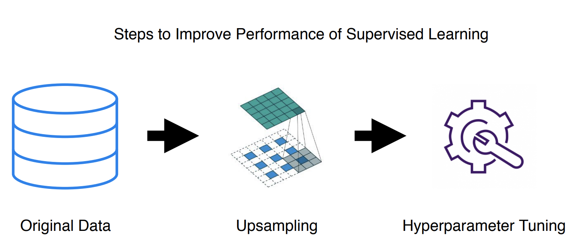
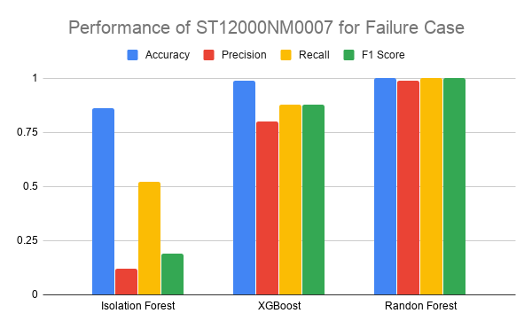

#### CS 7461 Project 21: [Akarshit Wal](https://github.com/Akarshit), [Gnanaguruparan Aishvaryaadevi](https://github.com/Aishvaryaa), [Karthik Nama Anil](https://github.com/KarthikNA), [Parth Tamane](https://github.com/parthv21), [Vaishnavi Kannan](https://github.com/Vaishnavik22)  

    

# Introduction

Hard disk failures can be catastrophic in large scale data centers leading to potential loss of all data. To alleviate the impact of such failures, companies are actively looking at ways to predict disk failures and take preemptive measures. Our project explores unsupervised and supervised learning techniques to predict and analyze hard drive crashes. The objective of using both supervised and unsupervised algorithms is to make a comparison between them. If companies are able to predict the failure of their hard-drives, it would save tons of money and help them gain customer trust. Admittedly there are cases where the disk failure cannot be predicted, like electricity failure in the server, natural hazard, etc. But most of the hardware failures don't happen overnight. A hard-disk starts to show reduced performance in some of the attributes before failing. Recognizing these attributes and training a machine learning model to predict failure based on these attributes is the main goal of our project.

# Motivation

In the last few years, all companies are moving to the cloud and adopting the Software as a Service (SaaS) model. There is a rise in demand for cloud storage. We have observed the development of Storage Area Networks (SANs) and Content Distribution Networks (CDN) to store and serve the content to everyone. Hard disk drives are the physical devices that store all this information in different formats. Over the years, the cost of memory has decreased significantly, but hard disks are still quite expensive. It is necessary to know when a particular hard disk may fail so that the data center can take necessary action like copying data for backup or procure replacement drives. Analyzing different metrics can also help the data center determine the optimal operating conditions. Additionally, data centers can identify models that are continuously failing and stop using those particular hard disks to minimize losses. Furthermore, the hard disk manufactures can use the results of this analysis to identify potential faults in the design of hard disk and rectify the same. The proposed machine learning models can effectively predict hard disk failure by evaluating the various Self-Monitoring, Analysis, and Reporting Technology (SMART) statistics.

# Problem Statement

Prediction of hard disk failures using S.M.A.R.T attributes collected over the life time of the hard disk.

# Related Work

Predicting hard disk failure is not a new challenge. Using S.M.A.R.T attributes earlier passive prediction involved traditional threshold-based algorithms. But these were successful in predicting drive failures only 3-10% of the time [1]. Thus, we saw a shift to more active, learning-based algorithms that use S.M.A.R.T attributes to make predictions. These attributes are different hard drive reliability indicators of imminent failure. They are also hard drive model-specific, and their meaning might differ across manufacturers. To accommodate these nuances, previous works [2] [3] train algorithms on specific models. Transfer learning techniques have been used to implement the same trained algorithm for different models [2]. However, the algorithm does not perform as well in the second model. 
Since hard disks do not fail very often, the dataset is highly unbalanced. To overcome this, work has been done in exploring the efficiency of SMOTE (Synthetic Minority Oversampling Technique) [4] and resampling [5] techniques. 

All the aforementioned works implemented supervised learning techniques. The best results were obtained using Random Forests or its variant. [4] reported precision of 95% and recall of 67% when using Random Forest on the 2014 Backblaze dataset. The gradient boosted trees also performed similarly well, reaching a precision of 94% and recall of 67%. They used a subset of the S.M.A.R.T parameters (5, 12, 187, 188, 189, 190, 198, 199 and 200). [3] explores classification trees, recurrent neural networks, part voting random forests and random forests. They trained their algorithms for one hard disk model from the Backblaze data set. Part voting random forests were able to attain a failure detection rate of 100% and a false alarm rate of 1.76% for model ST3000DM001. Select features of this model were used in the training. 

Many other works also achieved desirable performance using random forests. Thus, we decided to focus our supervised learning on this method. However, unlike the previous works, we decided to use all the features for a given model. Also, instead of separately looking at 
precision and recall, we measured our model's performance using the F1 score. 

# Dataset

Backblaze owns and operates multiple data centers that have thousands of hard disk drives. 
They regularly share data about the performance of these drives as well as other insights from their datacenters. 

    

Every disk drive includes Self-Monitoring, Analysis, and Reporting Technology (S.M.A.R.T), 
which reports internal information about the drive and its primary function is to detect 
as well as report multiple indicators of hard disk drive reliability with the intent of anticipating 
imminent hardware failures.

Backblaze takes a snapshot of each operational hard drive daily and the data includes drive’s serial number, model number, disk capacity, 
a label indicating disk failure, and S.M.A.R.T stats.  

Data for the project was collected from January 1st, 2019 to December 31st, 2019 and data was in 365 CSV files
with each representing one day of the year. Each file has 129 columns. 62 S.M.A.R.T statistics is represented both as raw values as well as normalized values(a total of 124 columns). The other columns provide information about the hard disk and the date of the record. The data is temporal in nature and is more than 10 GB in size. We have 40.7 million
data points or records in the dataset in total.

The dataset can be downloaded [here](https://www.backblaze.com/b2/hard-drive-test-data.html).

# Methodology and Results

The data obtained from Backblaze was aggregated and cleaned using different techniques. 
Relevant features were determined for further analysis. Combinations of supervised and unsupervised learning
techniques were adopted to predict the failure of a hard disk drive from S.M.A.R.T statistics and cluster hard drives based on S.M.A.R.T statistics. The results were further analyzed and visualized.

    

## Data Cleaning

We observed that different hard disks showed significantly different behavior at the time of failure. Additionally, we identified different S.M.A.R.T statistics that were needed to identify the failure of each hard disk model. Since the hard-disks are working most of the time, the data was biased towards non-failure. Also as soon as the hard-disk failed, it was removed from the server. Hence we only got one datapoint of the hard-disk failing while several of when it was working. To reduce this bias, we only worked with dataset in which the hard-disk was failing frequently and only sampled few of the data-points where the hard-disk was operational.

    

We observed that ST12000NM0007 was the most used hard disk in the dataset and at the same time, the one that failed the most in the dataset. It had more than twice the number of 
failures than any other hard disk in the dataset. 
The image below shows the five hard disks we shortlisted for further analysis.

    

We created a subset of the dataset by only selecting the records with the model ST12000NM0007. 
We first dropped the normalized S.M.A.R.T statistics in the analysis since critical information about the S.M.A.R.T statistic was lost during the normalization process. Additionally, 
the same information was captured by the same raw S.M.A.R.T statistics. Then we dropped the columns with only NaN values or missing values. Lastly, we eliminated all columns that had the same value for all the records since it would not help in any manner for the machine learning algorithm. We applied the same procedure to obtain subsets of data for the other four models as well for further analysis.

    

## Feature Selection

Expert domain knowledge and PCA was used to determine the important features for each of the models. Backblaze suggested using the raw S.M.A.R.T statistic 5, 187, 188, 197 and 198 
for the analysis purpose[9]. We observed similar suggestions in research papers in the domain. Furthermore, we included the other columns that were remaining after the data cleaning process. 

The variation in S.M.A.R.T statistic values obtained from 
working hard drives and failed hard drives is very small and hence makes data in a lower 
feature space indistinguishable. thus, PCA was not helpful in the feature selection process. We observed that running the different machine learning 
algorithms using the features selected by PCA resulted in worse results than the expert 
suggested features.

## Supervised Learning

We approached the task of predicting hard disk failures using Supervised as well as Unsupervised Learning algorithms.

The dataset used for both the algorithms is the Backblaze dataset which composes of S.M.A.R.T attributes corresponding to the hard drives. Since the meaning and range of values of the same  S.M.A.R.T attributes can change across models, we decided to create a separate classifier for predicting failures of each hard disk model. We tested performance on 2 classifiers 1) Random Forest and 2) XGBoost so that we good get a better idea of how various transformations to the dataset were improving over all performance.

    

One of the major challenges we faced was the class imbalance problem where we have significantly fewer records for failed disks when compared to those that did not fail. This is primarily because the failure of a hard disk is a rare event given its life span. Only 0.000585% of the dataset consisted of failed records. The label for the failed disk is marked as 1 only on the day of its failure and remains 0 on all other days. 

As shown in Table 1 below, although the accuracy of prediction, in this case, was high, recall, however, was extremely low (0.05) rendering this model ineffective in making good predictions. In the problem of disk failure detection, we require a high recall as it aims to identify what proportion of actual positives was identified correctly. This is most important to us as we wouldn't want to miss predicting a possible failure event. 

##### Table 1 : Random Forest results on original dataset for the 1st quarter of 2019

> Accuracy:  0.9994109693116142

|labels|precision|recall|f1-score | 
|------|---------|------|---------|
|0     |1.00     |1.00  |1.00     |
|1     |0.47     |0.05  |0.08     |

The most logical approach to address this class imbalance problem was to make the data for both the classes comparable. At first, we used the data for hard disk ST12000NM0007 in the first quarter of 2019 by modifying the label for the last 10 days of a failed hard disk to 1. Even with this approach, we had 371048 rows for disks that did not fail and 11257 rows for those that failed. Table 2 shows the results XGBoost gave us after this step. 

##### Table 2 : XGBoost results after limiting to last 10 days for the 1st quarter of 2019

> Accuracy:   0.9951358893008677

|labels|precision|recall|f1-score | 
|------|---------|------|---------|
|0     |1.00     |1.00  |1.00     |
|1     |0.89     |0.16  |0.28     |

Since this showed us improvements in terms of precision and recall, we tried two techniques to augment data for the failing drives -  1) SMOTE and 2) Random resampling with replacement. The upsampling was done only using the training data and the testing data was left untouched.

What we observed empirically and was confirmed by other researchers is that SMOTE does not work well when the dimensionality of data is large.[8] So we decided to use the resample function from sklearn and upsample only the training data for failed hard disks. We also tried to downsample the good drive's data to match the number failed drive records, but this produced too little training data set and did not really work well. 

Now that we had our base data ready, next came the task of parameter tuning. We used GridSearchCV to tune XGBoost and RandomizedSearchCV for tuning RandomForest. In both cases, the F1 score was used as the metric to tune the model on. 

One important point to note is that since we're dealing with time-series data, we used the most recent 30% of the dataset for testing and the remaining 70% for training without shuffling the data. This ensures that we train on past data to predict future data.

In the following graph, we can see how the performance improved as we transformed the dataset and tuned the model.

    

We can see in Table 3 below the improved results after parameter tuning of the Random Forest Classifier on the testing dataset.

##### Table 3 :  Random Forest results on testing dataset post parameter tuning

<table class="tg">
  <tr>
    <th class="tg-0pky">Model</th>
    <th class="tg-c3ow">Accuracy</th>
    <th class="tg-c3ow">Label</th>
    <th class="tg-c3ow">Precision</th>
    <th class="tg-c3ow">Recall</th>
    <th class="tg-c3ow">F1</th>
    <th class="tg-0lax">Support</th>
  </tr>
  
  <tr>
    <td class="tg-0pky" rowspan="2">ST12000NM0007</td>
    <td class="tg-c3ow" rowspan="2">0.9997123</td>
    <td class="tg-baqh">0</td>
    <td class="tg-baqh">1</td>
    <td class="tg-baqh">1</td>
    <td class="tg-baqh">1</td>
    <td class="tg-0lax">74210</td>
  </tr>
  <tr>
    <td class="tg-baqh">1</td>
    <td class="tg-baqh">0.99</td>
    <td class="tg-baqh">1</td>
    <td class="tg-baqh">1</td>
    <td class="tg-0lax">2252</td>
  </tr>
  
  <tr>
    <td class="tg-0pky" rowspan="2">ST4000DM000</td>
    <td class="tg-c3ow" rowspan="2">0.9999358</td>
    <td class="tg-baqh">0</td>
    <td class="tg-baqh">1</td>
    <td class="tg-baqh">1</td>
    <td class="tg-baqh">1</td>
    <td class="tg-0lax">45926</td>
  </tr>
  <tr>
    <td class="tg-baqh">1</td>
    <td class="tg-baqh">1</td>
    <td class="tg-baqh">1</td>
    <td class="tg-baqh">1</td>
    <td class="tg-0lax">794</td>
  </tr>

   <tr>
    <td class="tg-0pky" rowspan="2">ST8000NM0055</td>
    <td class="tg-c3ow" rowspan="2">1</td>
    <td class="tg-baqh">0</td>
    <td class="tg-baqh">1</td>
    <td class="tg-baqh">1</td>
    <td class="tg-baqh">1</td>
    <td class="tg-0lax">28906</td>
  </tr>
  <tr>
    <td class="tg-baqh">1</td>
    <td class="tg-baqh">1</td>
    <td class="tg-baqh">1</td>
    <td class="tg-baqh">1</td>
    <td class="tg-0lax">436</td>
  </tr>
  
  
  <tr>
    <td class="tg-0pky" rowspan="2">ST8000DM002</td>
    <td class="tg-c3ow" rowspan="2">1</td>
    <td class="tg-baqh">0</td>
    <td class="tg-baqh">1</td>
    <td class="tg-baqh">1</td>
    <td class="tg-baqh">1</td>
    <td class="tg-0lax">19627</td>
  </tr>
  <tr>
    <td class="tg-baqh">1</td>
    <td class="tg-baqh">1</td>
    <td class="tg-baqh">1</td>
    <td class="tg-baqh">1</td>
    <td class="tg-0lax">239</td>
  </tr>
  
  <tr>
    <td class="tg-0pky" rowspan="2">TOSHIBA MQ01ABF050 </td>
    <td class="tg-c3ow" rowspan="2">0.9990637</td>
    <td class="tg-baqh">0</td>
    <td class="tg-baqh">1</td>
    <td class="tg-baqh">1</td>
    <td class="tg-baqh">1</td>
    <td class="tg-0lax">912</td>
  </tr>
  <tr>
    <td class="tg-baqh">1</td>
    <td class="tg-baqh">0.99</td>
    <td class="tg-baqh">1</td>
    <td class="tg-baqh">1</td>
    <td class="tg-0lax">156</td>
  </tr>

</table>

Tables 4 and 5 describe the results obtained from the XGBoost Classifier on the validation and testing dataset. These results clearly illustrate that the variance of the models created is low. 

##### Table 4 :  XGBoost classifier results on validation dataset post parameter tuning

<table class="tg">
  <tr>
    <th class="tg-0pky">Model</th>
    <th class="tg-c3ow">Accuracy</th>
    <th class="tg-c3ow">Label</th>
    <th class="tg-c3ow">Precision</th>
    <th class="tg-c3ow">Recall</th>
    <th class="tg-c3ow">F1</th>
    <th class="tg-0lax">Support</th>
  </tr>
  
  <tr>
    <td class="tg-0pky" rowspan="2">ST12000NM0007</td>
    <td class="tg-c3ow" rowspan="2"> 0.9919698</td>
    <td class="tg-baqh">0</td>
    <td class="tg-baqh">1</td>
    <td class="tg-baqh"> 0.99</td>
    <td class="tg-baqh">1</td>
    <td class="tg-0lax">74210</td>
  </tr>
  <tr>
    <td class="tg-baqh">1</td>
    <td class="tg-baqh">0.79</td>
    <td class="tg-baqh">1</td>
    <td class="tg-baqh">0.88</td>
    <td class="tg-0lax">2252</td>
  </tr>
  
  <tr>
    <td class="tg-0pky" rowspan="2">ST4000DM000</td>
    <td class="tg-c3ow" rowspan="2">0.9991438</td>
    <td class="tg-baqh">0</td>
    <td class="tg-baqh">1</td>
    <td class="tg-baqh">1</td>
    <td class="tg-baqh">1</td>
    <td class="tg-0lax">45926</td>
  </tr>
  <tr>
    <td class="tg-baqh">1</td>
    <td class="tg-baqh">0.91</td>
    <td class="tg-baqh">1</td>
    <td class="tg-baqh">0.95</td>
    <td class="tg-0lax">794</td>
  </tr>
  
   <tr>
    <td class="tg-0pky" rowspan="2">ST8000NM0055</td>
    <td class="tg-c3ow" rowspan="2"> 0.9999659</td>
    <td class="tg-baqh">0</td>
    <td class="tg-baqh">1</td>
    <td class="tg-baqh">1</td>
    <td class="tg-baqh">1</td>
    <td class="tg-0lax">28906</td>
  </tr>
  <tr>
    <td class="tg-baqh">1</td>
    <td class="tg-baqh">1</td>
    <td class="tg-baqh">1</td>
    <td class="tg-baqh">1</td>
    <td class="tg-0lax">436</td>
  </tr>  
  
  <tr>
    <td class="tg-0pky" rowspan="2">ST8000DM002</td>
    <td class="tg-c3ow" rowspan="2">1</td>
    <td class="tg-baqh">0</td>
    <td class="tg-baqh">1</td>
    <td class="tg-baqh">1</td>
    <td class="tg-baqh">1</td>
    <td class="tg-0lax">19627</td>
  </tr>
  <tr>
    <td class="tg-baqh">1</td>
    <td class="tg-baqh">0.99</td>
    <td class="tg-baqh">1</td>
    <td class="tg-baqh">1</td>
    <td class="tg-0lax">239</td>
  </tr>
  
   <tr>
    <td class="tg-0pky" rowspan="2">TOSHIBA MQ01ABF050 </td>
    <td class="tg-c3ow" rowspan="2">1</td>
    <td class="tg-baqh">0</td>
    <td class="tg-baqh">1</td>
    <td class="tg-baqh">1</td>
    <td class="tg-baqh">1</td>
    <td class="tg-0lax">912</td>
  </tr>
  <tr>
    <td class="tg-baqh">1</td>
    <td class="tg-baqh">1</td>
    <td class="tg-baqh">1</td>
    <td class="tg-baqh">1</td>
    <td class="tg-0lax">156</td>
  </tr>
 
</table>

##### Table 5 :  XGBoost classifier results on testing dataset post parameter tuning

<table class="tg">
  <tr>
    <th class="tg-0pky">Model</th>
    <th class="tg-c3ow">Accuracy</th>
    <th class="tg-c3ow">Label</th>
    <th class="tg-c3ow">Precision</th>
    <th class="tg-c3ow">Recall</th>
    <th class="tg-c3ow">F1</th>
    <th class="tg-0lax">Support</th>
  </tr>
  
  <tr>
    <td class="tg-0pky" rowspan="2">ST12000NM0007</td>
    <td class="tg-c3ow" rowspan="2"> 0.9851821</td>
    <td class="tg-baqh">0</td>
    <td class="tg-baqh">1</td>
    <td class="tg-baqh"> 0.98</td>
    <td class="tg-baqh">0.99</td>
    <td class="tg-0lax">74210</td>
  </tr>
  <tr>
    <td class="tg-baqh">1</td>
    <td class="tg-baqh">0.67</td>
    <td class="tg-baqh">1</td>
    <td class="tg-baqh">0.80</td>
    <td class="tg-0lax">2252</td>
  </tr>
  
  <tr>
    <td class="tg-0pky" rowspan="2">ST4000DM000</td>
    <td class="tg-c3ow" rowspan="2">0.9941780</td>
    <td class="tg-baqh">0</td>
    <td class="tg-baqh">1</td>
    <td class="tg-baqh">0.99</td>
    <td class="tg-baqh">1</td>
    <td class="tg-0lax">45926</td>
  </tr>
  <tr>
    <td class="tg-baqh">1</td>
    <td class="tg-baqh">0.74</td>
    <td class="tg-baqh">1</td>
    <td class="tg-baqh">0.85</td>
    <td class="tg-0lax">794</td>
  </tr>
  
   <tr>
    <td class="tg-0pky" rowspan="2">ST8000NM0055</td>
    <td class="tg-c3ow" rowspan="2"> 0.9997273</td>
    <td class="tg-baqh">0</td>
    <td class="tg-baqh">1</td>
    <td class="tg-baqh">1</td>
    <td class="tg-baqh">1</td>
    <td class="tg-0lax">28906</td>
  </tr>
  <tr>
    <td class="tg-baqh">1</td>
    <td class="tg-baqh">0.98</td>
    <td class="tg-baqh">1</td>
    <td class="tg-baqh">0.99</td>
    <td class="tg-0lax">436</td>
  </tr>  
  
  <tr>
    <td class="tg-0pky" rowspan="2">ST8000DM002</td>
    <td class="tg-c3ow" rowspan="2">0.9997483</td>
    <td class="tg-baqh">0</td>
    <td class="tg-baqh">1</td>
    <td class="tg-baqh">1</td>
    <td class="tg-baqh">1</td>
    <td class="tg-0lax">19627</td>
  </tr>
  <tr>
    <td class="tg-baqh">1</td>
    <td class="tg-baqh">0.98</td>
    <td class="tg-baqh">1</td>
    <td class="tg-baqh">0.99</td>
    <td class="tg-0lax">239</td>
  </tr>
  
   <tr>
    <td class="tg-0pky" rowspan="2">TOSHIBA MQ01ABF050 </td>
    <td class="tg-c3ow" rowspan="2">0.9990636</td>
    <td class="tg-baqh">0</td>
    <td class="tg-baqh">1</td>
    <td class="tg-baqh">1</td>
    <td class="tg-baqh">1</td>
    <td class="tg-0lax">912</td>
  </tr>
  <tr>
    <td class="tg-baqh">1</td>
    <td class="tg-baqh">0.99</td>
    <td class="tg-baqh">1</td>
    <td class="tg-baqh">1</td>
    <td class="tg-0lax">156</td>
  </tr>
 
</table>

## Unsupervised Learning

### Seperation of Good vs Failed Disk

We wanted to analyze if clustering algorithms can result in two clusters – good hard drives and those that failed. This would help in identifying if a disk will fail based on its cluster membership.

Model tested for: ST12000NM0007 

Data set: Last recorded entry for each drive

We reduced to two features using PCA, for visualization. 

    

Since there are no distinct clusters of good and failed drives, applying K-Means to this data set did not give accurate results. 

### Hard Disk Model Detection

Another thing we explored was the identification of the model number based on the drive attributes. This would help in identifying a new hard disk that was similar to a previously failed hard disk. This would mean that whatever problems were causing the base hard disk to fail would be the likely issues that would cause this new hard disk to fail. 

We used clustering algorithms (DBSCAN, k-Means) to cluster into models based on S.M.A.R.T attributes. As stated earlier, since many SMART attributes do not have uniform meaning across manufacturers, we decided to use only those attributes that are present across all models. These are SMART attribute numbers 5, 187, 188, 197, 198.

Models: ST8000DM002, ST8000NM0055, ST12000NM0007, ST4000DM000

Data set: Last recorded entry for each drive

We again applied PCA on these five attributes and reduced them to two attributes.

    

We realized that clustering algorithms will not be able to produce distinct clusters based on these five attributes alone. Our results confirmed this. Resampling was also not helpful because the values of the features do not change. Thus, we analyzed the dataset to find another feature that was present across all models. The capacity of the hard disk satisfied this criterion. 

Performing PCA on these six attributes and reducing them to two attributes, we got: 

    

1. *DBSCAN*  
After using grid search on the minimum number of neighbors in the DBSCAN algorithm, we got an accuracy of 83.87% in predicting the model number of a hard disk.

2. *K-Means*  
Using the elbow method to find the number of clusters, as observed in PCA, we got k=3. But we ran the model for k=4 since we know that there are 4 models. This gave an accuracy of 88.23%.

    

From above, it is evident that clustering algorithms cannot be used for predicting if the hard drive will fail. However, along with capacity, it could be used to predict which model a hard drive is most similar to.

### Anomaly Detection

Since clustering algorithms did not perform well for failure classification, due to the type of dataset we had, we turned to anomaly detection. We used the Isolation Forest anomaly detection algorithm. However, since this technique also relies on having distinct features for the failed data, which is not true for our dataset, even the tuned models could not accurately identify the failed drives. 

##### Table 6 : Isolation Forest Results
<table class="tg">
  <tr>
    <th class="tg-0pky">Model</th>
    <th class="tg-c3ow">Accuracy</th>
    <th class="tg-c3ow">Label</th>
    <th class="tg-c3ow">Precision</th>
    <th class="tg-c3ow">Recall</th>
    <th class="tg-c3ow">F1</th>
    <th class="tg-0lax">Support</th>
  </tr>
  
  <tr>
    <td class="tg-0pky" rowspan="2">ST12000NM0007</td>
    <td class="tg-c3ow" rowspan="2"> 0.8691</td>
    <td class="tg-baqh">0</td>
    <td class="tg-baqh">0.98</td>
    <td class="tg-baqh">0.88</td>
    <td class="tg-baqh">0.93</td>
    <td class="tg-0lax">7425</td>
  </tr>
  <tr>
    <td class="tg-baqh">1</td>
    <td class="tg-baqh">0.12</td>
    <td class="tg-baqh">0.52</td>
    <td class="tg-baqh">0.19</td>
    <td class="tg-0lax">227</td>
  </tr>
  
  <tr>
    <td class="tg-0pky" rowspan="2">ST4000DM000</td>
    <td class="tg-c3ow" rowspan="2">0.6331</td>
    <td class="tg-baqh">0</td>
    <td class="tg-baqh">0.98</td>
    <td class="tg-baqh">0.64</td>
    <td class="tg-baqh">0.77</td>
    <td class="tg-0lax">45926</td>
  </tr>
  <tr>
    <td class="tg-baqh">1</td>
    <td class="tg-baqh">0.01</td>
    <td class="tg-baqh">0.13</td>
    <td class="tg-baqh">0.01</td>
    <td class="tg-0lax">794</td>
  </tr>
  
  <tr>
    <td class="tg-0pky" rowspan="2">ST8000NM0055</td>
    <td class="tg-c3ow" rowspan="2">0.215792</td>
    <td class="tg-baqh">0</td>
    <td class="tg-baqh">0.98</td>
    <td class="tg-baqh">0.54</td>
    <td class="tg-baqh">0.70</td>
    <td class="tg-0lax">28906</td>
  </tr>
  <tr>
    <td class="tg-baqh">1</td>
    <td class="tg-baqh">0.01</td>
    <td class="tg-baqh">0.24</td>
    <td class="tg-baqh">0.01</td>
    <td class="tg-0lax">436</td>
  </tr>
  
  <tr>
    <td class="tg-0pky" rowspan="2">ST8000DM002</td>
    <td class="tg-c3ow" rowspan="2">0.1331276</td>
    <td class="tg-baqh">0</td>
    <td class="tg-baqh">0.98</td>
    <td class="tg-baqh">0.41</td>
    <td class="tg-baqh">0.57</td>
    <td class="tg-0lax">19627</td>
  </tr>
  <tr>
    <td class="tg-baqh">1</td>
    <td class="tg-baqh">0.00</td>
    <td class="tg-baqh">0.20</td>
    <td class="tg-baqh">0.01</td>
    <td class="tg-0lax">239</td>
  </tr>  
  
  <tr>
    <td class="tg-0pky" rowspan="2">TOSHIBA MQ01ABF050 </td>
    <td class="tg-c3ow" rowspan="2">0.48408</td>
    <td class="tg-baqh">0</td>
    <td class="tg-baqh">0.82</td>
    <td class="tg-baqh">0.51</td>
    <td class="tg-baqh">0.63</td>
    <td class="tg-0lax">912</td>
  </tr>
  <tr>
    <td class="tg-baqh">1</td>
    <td class="tg-baqh">0.11</td>
    <td class="tg-baqh">0.35</td>
    <td class="tg-baqh">0.17</td>
    <td class="tg-0lax">156</td>
  </tr>
  
</table>

    

Thus, for the given dataset from our analysis, it is best to use supervised learning techniques like Random Forest (bagging) and XGBoost (boosting). In these methods, the data points even if extremely similar are accurately classified using sufficient tree levels and a number of features to split.

# What's New in Our Approach?
Through extensive parameters tuning and efficient resampling of data set, we are able to achieve better model performance than existing works. Also, as the Backblaze data set has class labels it is well-suited for supervised learning. Thus, all prior notable works focus on building a classifier that can make accurate predictions. In addition to implementing supervised learning techniques, we analyze if the problem of predicting hard disk failure can be solved using unsupervised methods. Earlier works mainly use unsupervised learning to augment data and tackle the class imbalance problem. To the best of our knowledge, we are the first to apply and assess the efficiency of using anomaly detection on the Backblaze dataset to predict failure events.

# Conclusion
In this project, we predicted if a hard disk will fail based on its SMART attributes. We observed that the number of failed entries is significantly lower. Thus, we resorted to using data augmentation techniques like SMOTE and data resampling. After further analyzing the data we realized that creating a generic model is not feasible as the S.M.A.R.T attributes are not uniform across all manufacturers. Thus, we applied supervised learning classifiers like Random Forest and XGBoost on individual models. The results indicated that these trained classifiers can predict whether a hard disk (of one of the models used in the training) will fail or not. Random forest algorithm gave an F1 score of 1 for all the models. We extended our study to unsupervised clustering methods like DBSCAN and K-Means and concluded that we cannot use these clustering algorithms because of how our data was spread. Finally, since failures are anomalous behaviors, we also explored anomaly detection using Isolation Forest.

# Future Work
We suspect that our models are overfitting on cases where there were very few hard disk failures i.e. TOSHIBA MQ01ABF050 and ST8000DM002. Hence, to overcome the class imbalance problem, we would like to evaluate superior data augmentation techniques that would help reduce model overfitting. We would also like to explore the possibility of creating a generic classifier for all hard disk models and then employ transfer learning to further fine-tune for each model.

# References
1. C. Xu, G. Wang, X. Liu, D. Guo, and T. Liu. Health status assessment and failure prediction for hard drives with recurrent neural networks. IEEE Transactions on Computers, 65(11):3502–3508, Nov 2016.
2. Mirela Madalina Botezatu, Ioana Giurgiu, Jasmina Bogojeska, and Dorothea Wiesmann. Predicting disk re- placement towards reliable data centers. In Proceedings of the 22nd ACM SIGKDD International Conference on Knowledge Discovery and Data Mining, 2016.
3. Jing Shen, Jian Wan, Se-Jung Lim, and Lifeng Yu. Random-forest-based failure prediction for hard disk drives. International Journal of Distributed Sensor Networks, 14(11):1550147718806480, 2018.
4. Nicolas Aussel, Samuel Jaulin, Guillaume Gandon, Yohan Petetin, Eriza Fazli, et al.. Predictive models of hard drive failures based on operational data. ICMLA 2017 : 16th IEEE International Conference On Machine Learning And Applications, Dec 2017, Cancun, Mexico. 
5. Wendy Li, Ivan Suarez, Juan Camacho,Proactive Prediction of Hard Disk Drive Failure-Project
6. Backblaze. Backblaze hard drive state, 2020.
7. J. Li et al. Hard drive failure prediction using classification and regression trees. In 44th Annual IEEE/IFIP International Conference on Dependable Systems and Networks, Atlanta, GA, 2014, 2014.
8. Blagus, R., Lusa, L. SMOTE for high-dimensional class-imbalanced data. BMC Bioinformatics 14, 106 (2013)
9. Andy Klein, "What SMART Stats Tell Us About Hard Drives", October 6, 2016, Available : https://www.backblaze.com/blog/what-smart-stats-indicate-hard-drive-failures/. [Accessed: April 11, 2020]

----

Dataset = [Hard Drive Data and Stats - Hard drive failure data and stats from 2019](https://www.kaggle.com/jackywangkaggle/hard-drive-data-and-stats)

Source = [Hard Drive Data and Stats](https://www.backblaze.com/b2/hard-drive-test-data.html)

# S.M.A.R.T Stats List

[List of all S.M.A.R.T. Attributes Including Vendor Specific](https://www.data-medics.com/forum/list-of-all-s-m-a-r-t-attributes-including-vendor-specific-t1476.html)

[List of Public SMART Attributes](http://www.t13.org/Documents/UploadedDocuments/docs2005/e05173r0-ACS-SMARTAttributes_List.pdf)

[Western Digital SMART attributes](https://sourceforge.net/p/smartmontools/mailman/message/23829511/)

