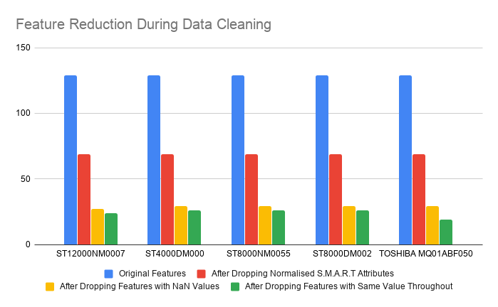

#### CS 7461 Project 21: [Akarshit Wal](https://github.com/Akarshit), [Gnanaguruparan Aishvaryaadevi](https://github.com/Aishvaryaa), [Karthik Nama Anil](https://github.com/KarthikNA), [Parth Tamane](https://github.com/parthv21), [Vaishnavi Kannan](https://github.com/Vaishnavik22)  

    

# Introduction

Hard disk failures can be catastrophic in large scale data centers. It can lead to potential loss of all important and sensitive data stored in these data centers. To alleviate the impact of such failures, companies are actively looking at ways to predict disk failures and take preemptive measures. If companies are able to predict the failure of their hard-drives, it would reduce the economic impact incurred by the company due to these failures greatly, and protect data thereby maintaining customer trust. Admittedly, there are situations such as electricity failure in the server, natural hazard, etc.  where the failure of disks cannot be predicted. However, most of the hardware failures don't happen overnight and hard disks starts to show significant reduced performance over the last few days of their lifetime before failing. Uncovering these patterns, 
recognizing features that may be attributed to the failure of a hard disk, and predicting the event of hard disk crash through machine learning, is the main goal of our project. Our project explores unsupervised and supervised learning techniques to predict and analyze hard drive crashes. The objective of using both supervised and unsupervised algorithms is to make a comparison between them. 

# Motivation

In the last few years, all companies are moving to the cloud and adopting the Software as a Service (SaaS) model. There is a rise in demand for cloud storage. We have observed the development of Storage Area Networks (SANs) and Content Distribution Networks (CDN) to store and serve the content to everyone. Hard disk drives are the physical devices that store all this information in different formats. Over the years, the cost of memory has decreased significantly, but hard disks are still quite expensive. It is necessary to know when a particular hard disk may fail so that the data center can take necessary action such as copying data for backup, and procuring replacement drives. The need for a proactive method to predict failure events is felt and to address this issue, satistical and Machine Learning techniques are being adopted popularly. 

Apart from proactive prediction, analyzing different metrics can also help the data center determine the optimal operating conditions. Additionally, data centers can identify models that have been consistenly performing poorly and minimize their losses by avoiding the use of these models. These analysis can also be extremely useful for hard disk manufactures as they can leverage the results of this analysis to identify potential faults in the design of hard disk and rectify the same.

Recent research efforts that use Self-Monitoring, Analysis, and Reporting Technology (S.M.A.R.T) statistics to predict hard disk failure have proven to be highly successful. We aim to use these S.M.A.R.T attributes to uncover interesting predictions ourselves.

# Problem Statement

Prediction of hard disk failures using S.M.A.R.T attributes collected over the life time of hard disks.

# Related Work

The task of hard disk failure prediction has been the primary focus of many researches over the recent few decades. Traditional approaches used a threshold-based algorithm. These however, were successful in predicting drive failures only 3-10% of the time [1]. Thus, we saw a shift to more proactive, learning-based algorithms that use S.M.A.R.T attributes to make predictions. These attributes are different hard drive reliability indicators of imminent failure. 

In "Predictive models of hard drive failures based on operational data" [4], Nicolas and Samuel proposed using Random Forest and its variants for hard disk failure prediction. They achieved a very high accuracy of 99.98% and reported precision of 95% and recall of 67% when using Random Forest on the 2014 Backblaze dataset. The gradient boosted trees also performed similarly well, reaching a precision of 94% and recall of 67%. They used a subset of the S.M.A.R.T parameters (5, 12, 187, 188, 189, 190, 198, 199 and 200). [3] explores classification trees, recurrent neural networks, part voting random forests and random forests. They trained their algorithms for one hard disk model from the Backblaze data set. Part voting random forests were able to attain a failure detection rate of 100% and a false alarm rate of 1.76% for model ST3000DM001. Select features of this model were used in the training. S.M.A.R.T attriutes are hard drive model-specific i.e the meaning of these attributes might differ across manufacturers. To accommodate these nuances, previous works [2] [3] explored ways to train algorithms on specific models instead of one generic model for predicition. The most recent studies leverage Transfer learning techniques[2] where classifiers trained on one model are used for predicting failures of other models. This however did not perform as well as they had hoped. Since the failure of hard disks is a rare event, the dataset is highly unbalanced. hence, in order to overcome this imbalance problem, work has also been done in exploring the efficiency of SMOTE (Synthetic Minority Oversampling Technique) [4] and resampling [5] techniques. All the implemented supervised learning techniques try to address this problem. 

In contrast to all the aforementioned works, we decided to focus on supervised as well as unsupervised learning techniques in this project. Instead of just looking at accuracy, we used F1 score as the primary metric to evaluate our algorithms. We have employed anamoly detection and clustering based techniques and contrasted their performance against supervised learning techniques that use tree-based classifiers. We have used only a subset of data (last 10 days of a hard disk lifetime) to train our models. This along with resampling helps us tackle the class imbalance problem. We have also ensured to maintain the time-sequence in the dataset in order to train better models.

# Dataset

Backblaze owns and operates multiple data centers that have thousands of hard disk drives. 
They regularly share data about the performance of these drives as well as other insights from their datacenters. 

    

Every disk drive includes Self-Monitoring, Analysis, and Reporting Technology (S.M.A.R.T) statistics, 
which reports internal information about the drive and its primary function is to detect 
as well as report multiple indicators of hard disk drive reliability with the intent of anticipating 
imminent hardware failures.

Backblaze takes a snapshot of each operational hard drive daily and the data includes drive’s serial number, model number, disk capacity, 
a label indicating disk failure, and S.M.A.R.T stats.  

Data for the project was collected from January 1st, 2019 to December 31st, 2019 and data was in 365 CSV files
with each representing one day of the year. Each file has 129 columns. 62 distinct S.M.A.R.T attributes are measured and represented both as raw values as well as normalized values totaling to 124 columns. The other columns provide information about the hard disk and the date of the record. The data is temporal in nature and is more than 10 GB in size. We have 40.7 million
data points or records in the dataset in total.

The dataset can be downloaded [here](https://www.backblaze.com/b2/hard-drive-test-data.html).

# Methodology and Results

The data obtained from Backblaze was aggregated and cleaned using different techniques. 
Relevant features were determined for further analysis. Combinations of supervised and unsupervised learning
techniques were adopted to predict the failure of a hard disk drive from S.M.A.R.T statistics and cluster hard drives based on S.M.A.R.T statistics. The results were further analyzed and visualized. Sub-sections below explain the above mentioned topics in detail.

    

## Data Cleaning

We started by observing the raw Backblaze data to get a better understanding of what all preprocessing techiniques were needed to be employed. We observed that different hard disks showed significantly different behavior in terms of S.M.A.R.T statistics at the time of failure. Since the failure of a hard disk is a very rare event given its life span, we also observed a heavy bias in the dataset. Just a few rows were labeled 1 indicating a failure of hard disk on the given day while on all other days of its lifetime, the label remained 0. The records corresponding to this hard disk are no longer available in the dataset. To reduce this bias, we only worked with dataset in which the hard-disk was failing frequently and only sampled a few of the data-points where the hard-disk was operational.

    

We observed that ST12000NM0007 was the most commonly used hard disk in the dataset and at the same time, the one that failed the most in the dataset. It had more than twice the number of failures than any other hard disk in the dataset. Naturally, data from this hard disk model was our first choice to experiment on. Based on our understanding of the dataset, we shortlisted 4 other hard disk data to work with. The image below shows the five selected hard disks.

    

We started the data cleaning/preprocessing step by creating a subset of the dataset with only model ST12000NM0007. We dropped the normalized S.M.A.R.T statistics and retained the raw values in our analysis as critical information about the S.M.A.R.T statistic was lost during the normalization process. Then we dropped the columns with only NaN values or missing values. Lastly, we eliminated all columns that had the same value for all the records since the importance of these features would be negligible in the machine learning algorithm. We applied the same procedure to obtain subsets of data for the other four models as well for further analysis.

    

## Feature Selection

Domain knowledge and PCA was used to determine the important features for each of the models. Backblaze suggested the use of raw S.M.A.R.T statistic 5, 187, 188, 197 and 198 for the purpose of analysis [9]. Similar suggestions were made in pioneering research papers in this domain. Hence, we included these 5 statistics along with the other columns that we retained after the data cleaning process. 

The variation in S.M.A.R.T statistic values obtained from working hard drives and failed hard drives is very small and hence makes data in a lower feature space indistinguishable. Thus, PCA was not helpful in the feature selection process. We observed that running the different machine learning algorithms using the features selected by PCA resulted in worse results than the expert suggested features.

## Supervised Learning

We approached the task of predicting hard disk failures using Supervised as well as Unsupervised Learning algorithms.

The dataset used for both the algorithms is the Backblaze dataset which composes of S.M.A.R.T attributes corresponding to the hard drives. Since the meaning and range of values of the same  S.M.A.R.T attributes can change across models, we decided to create a separate classifier for predicting failures of each hard disk model. We tested performance on 2 classifiers 1) Random Forest and 2) XGBoost so that we could get a better idea of how various transformations to the dataset were improving over all performance.

    

One of the major challenges we faced was the class imbalance problem where we have significantly fewer records for failed disks when compared to those that did not fail. This is primarily because the failure of a hard disk is a rare event given its life span. Only 0.000585% of the dataset consisted of failed records. The label for the failed disk is marked as 1 only on the day of its failure and remains 0 on all other days. 

As shown in Table 1 below, although the accuracy of prediction, in this case, was high, recall, however, was extremely low (0.05) rendering this model ineffective in making good predictions. In the problem of disk failure detection, we require a high recall as it aims to identify what proportion of actual positives was identified correctly. This is most important to us as we wouldn't want to miss predicting a possible failure event. 

##### Table 1 : Random Forest results on original dataset for the 1st quarter of 2019

> Accuracy:  0.9994109693116142

|Labels|Precision|Recall|F1       | 
|------|---------|------|---------|
|0     |1.00     |1.00  |1.00     |
|1     |0.47     |0.05  |0.08     |

The most logical approach to addressing this class imbalance problem was to make the data for both the classes comparable. At first, we used the data for hard disk ST12000NM0007 in the first quarter of 2019 by modifying the label for the last 10 days of a failed hard disk to 1. We took a lookback window of 10 days, as it gives sufficient time to analyze and fix/replace the drive. Even with this approach, we had 371048 rows for disks that did not fail and 11257 rows for those that failed. Table 2 shows the results XGBoost gave us after this step. 

##### Table 2 : XGBoost results after limiting to last 10 days for the 1st quarter of 2019

> Accuracy:   0.9951358893008677

|Labels|Precision|Recall|F1       | 
|------|---------|------|---------|
|0     |1.00     |1.00  |1.00     |
|1     |0.89     |0.16  |0.28     |

Since this showed us improvements in terms of precision and recall, we decided to set the lookback window of the good drives to 10 days as well. Then we tried two techniques to further augment data for the failing drives -  1) SMOTE and 2) Random resampling with replacement. The upsampling was done only using the training data and the testing data was left untouched.

What we observed empirically and was confirmed by other researchers is that SMOTE does not work well when the dimensionality of data is large.[8] So we decided to use the resample function from sklearn and upsample only the training data for failed hard disks. We also tried to downsample the good drive's data to match the number failed drive records, but this produced too little training data set and did not really work well. 

Now that we had our base data ready, next came the task of parameter tuning. We used GridSearchCV to tune XGBoost and RandomizedSearchCV for tuning RandomForest. In both cases, the F1 score was used as the metric to tune the model on. 

One important point to note is that since we're dealing with time-series data, we used the most recent 30% of the dataset for testing and the remaining 70% for training without shuffling the data. This ensures that we train on past data to predict future data.

In the following graph, we can see how the performance improved as we transformed the dataset and tuned the model.

    

Table 3 shows the improved results after parameter tuning has been performed on the Random Forest Classifier on the testing dataset.

##### Table 3 :  Random Forest results on testing dataset post parameter tuning

<table class="tg">
  <tr>
    <th class="tg-0pky">Model</th>
    <th class="tg-c3ow">Accuracy</th>
    <th class="tg-c3ow">Label</th>
    <th class="tg-c3ow">Precision</th>
    <th class="tg-c3ow">Recall</th>
    <th class="tg-c3ow">F1</th>
    <th class="tg-0lax">Support</th>
  </tr>
  
  <tr>
    <td class="tg-0pky" rowspan="2">ST12000NM0007</td>
    <td class="tg-c3ow" rowspan="2">0.9997123</td>
    <td class="tg-baqh">0</td>
    <td class="tg-baqh">1</td>
    <td class="tg-baqh">1</td>
    <td class="tg-baqh">1</td>
    <td class="tg-0lax">74210</td>
  </tr>
  <tr>
    <td class="tg-baqh">1</td>
    <td class="tg-baqh">0.99</td>
    <td class="tg-baqh">1</td>
    <td class="tg-baqh">1</td>
    <td class="tg-0lax">2252</td>
  </tr>
  
  <tr>
    <td class="tg-0pky" rowspan="2">ST4000DM000</td>
    <td class="tg-c3ow" rowspan="2">0.9999358</td>
    <td class="tg-baqh">0</td>
    <td class="tg-baqh">1</td>
    <td class="tg-baqh">1</td>
    <td class="tg-baqh">1</td>
    <td class="tg-0lax">45926</td>
  </tr>
  <tr>
    <td class="tg-baqh">1</td>
    <td class="tg-baqh">1</td>
    <td class="tg-baqh">1</td>
    <td class="tg-baqh">1</td>
    <td class="tg-0lax">794</td>
  </tr>

   <tr>
    <td class="tg-0pky" rowspan="2">ST8000NM0055</td>
    <td class="tg-c3ow" rowspan="2">1</td>
    <td class="tg-baqh">0</td>
    <td class="tg-baqh">1</td>
    <td class="tg-baqh">1</td>
    <td class="tg-baqh">1</td>
    <td class="tg-0lax">28906</td>
  </tr>
  <tr>
    <td class="tg-baqh">1</td>
    <td class="tg-baqh">1</td>
    <td class="tg-baqh">1</td>
    <td class="tg-baqh">1</td>
    <td class="tg-0lax">436</td>
  </tr>
  
  
  <tr>
    <td class="tg-0pky" rowspan="2">ST8000DM002</td>
    <td class="tg-c3ow" rowspan="2">1</td>
    <td class="tg-baqh">0</td>
    <td class="tg-baqh">1</td>
    <td class="tg-baqh">1</td>
    <td class="tg-baqh">1</td>
    <td class="tg-0lax">19627</td>
  </tr>
  <tr>
    <td class="tg-baqh">1</td>
    <td class="tg-baqh">1</td>
    <td class="tg-baqh">1</td>
    <td class="tg-baqh">1</td>
    <td class="tg-0lax">239</td>
  </tr>
  
  <tr>
    <td class="tg-0pky" rowspan="2">TOSHIBA MQ01ABF050 </td>
    <td class="tg-c3ow" rowspan="2">0.9990637</td>
    <td class="tg-baqh">0</td>
    <td class="tg-baqh">1</td>
    <td class="tg-baqh">1</td>
    <td class="tg-baqh">1</td>
    <td class="tg-0lax">912</td>
  </tr>
  <tr>
    <td class="tg-baqh">1</td>
    <td class="tg-baqh">0.99</td>
    <td class="tg-baqh">1</td>
    <td class="tg-baqh">1</td>
    <td class="tg-0lax">156</td>
  </tr>

</table>

Tables 4 and 5 describe the results obtained from the XGBoost Classifier on the validation and testing dataset. These results clearly illustrate that the variance of the models created is low. 

##### Table 4 :  XGBoost classifier results on validation dataset post parameter tuning

<table class="tg">
  <tr>
    <th class="tg-0pky">Model</th>
    <th class="tg-c3ow">Accuracy</th>
    <th class="tg-c3ow">Label</th>
    <th class="tg-c3ow">Precision</th>
    <th class="tg-c3ow">Recall</th>
    <th class="tg-c3ow">F1</th>
    <th class="tg-0lax">Support</th>
  </tr>
  
  <tr>
    <td class="tg-0pky" rowspan="2">ST12000NM0007</td>
    <td class="tg-c3ow" rowspan="2"> 0.9919698</td>
    <td class="tg-baqh">0</td>
    <td class="tg-baqh">1</td>
    <td class="tg-baqh"> 0.99</td>
    <td class="tg-baqh">1</td>
    <td class="tg-0lax">74210</td>
  </tr>
  <tr>
    <td class="tg-baqh">1</td>
    <td class="tg-baqh">0.79</td>
    <td class="tg-baqh">1</td>
    <td class="tg-baqh">0.88</td>
    <td class="tg-0lax">2252</td>
  </tr>
  
  <tr>
    <td class="tg-0pky" rowspan="2">ST4000DM000</td>
    <td class="tg-c3ow" rowspan="2">0.9991438</td>
    <td class="tg-baqh">0</td>
    <td class="tg-baqh">1</td>
    <td class="tg-baqh">1</td>
    <td class="tg-baqh">1</td>
    <td class="tg-0lax">45926</td>
  </tr>
  <tr>
    <td class="tg-baqh">1</td>
    <td class="tg-baqh">0.91</td>
    <td class="tg-baqh">1</td>
    <td class="tg-baqh">0.95</td>
    <td class="tg-0lax">794</td>
  </tr>
  
   <tr>
    <td class="tg-0pky" rowspan="2">ST8000NM0055</td>
    <td class="tg-c3ow" rowspan="2"> 0.9999659</td>
    <td class="tg-baqh">0</td>
    <td class="tg-baqh">1</td>
    <td class="tg-baqh">1</td>
    <td class="tg-baqh">1</td>
    <td class="tg-0lax">28906</td>
  </tr>
  <tr>
    <td class="tg-baqh">1</td>
    <td class="tg-baqh">1</td>
    <td class="tg-baqh">1</td>
    <td class="tg-baqh">1</td>
    <td class="tg-0lax">436</td>
  </tr>  
  
  <tr>
    <td class="tg-0pky" rowspan="2">ST8000DM002</td>
    <td class="tg-c3ow" rowspan="2">1</td>
    <td class="tg-baqh">0</td>
    <td class="tg-baqh">1</td>
    <td class="tg-baqh">1</td>
    <td class="tg-baqh">1</td>
    <td class="tg-0lax">19627</td>
  </tr>
  <tr>
    <td class="tg-baqh">1</td>
    <td class="tg-baqh">0.99</td>
    <td class="tg-baqh">1</td>
    <td class="tg-baqh">1</td>
    <td class="tg-0lax">239</td>
  </tr>
  
   <tr>
    <td class="tg-0pky" rowspan="2">TOSHIBA MQ01ABF050 </td>
    <td class="tg-c3ow" rowspan="2">1</td>
    <td class="tg-baqh">0</td>
    <td class="tg-baqh">1</td>
    <td class="tg-baqh">1</td>
    <td class="tg-baqh">1</td>
    <td class="tg-0lax">912</td>
  </tr>
  <tr>
    <td class="tg-baqh">1</td>
    <td class="tg-baqh">1</td>
    <td class="tg-baqh">1</td>
    <td class="tg-baqh">1</td>
    <td class="tg-0lax">156</td>
  </tr>
 
</table>

##### Table 5 :  XGBoost classifier results on testing dataset post parameter tuning

<table class="tg">
  <tr>
    <th class="tg-0pky">Model</th>
    <th class="tg-c3ow">Accuracy</th>
    <th class="tg-c3ow">Label</th>
    <th class="tg-c3ow">Precision</th>
    <th class="tg-c3ow">Recall</th>
    <th class="tg-c3ow">F1</th>
    <th class="tg-0lax">Support</th>
  </tr>
  
  <tr>
    <td class="tg-0pky" rowspan="2">ST12000NM0007</td>
    <td class="tg-c3ow" rowspan="2"> 0.9851821</td>
    <td class="tg-baqh">0</td>
    <td class="tg-baqh">1</td>
    <td class="tg-baqh"> 0.98</td>
    <td class="tg-baqh">0.99</td>
    <td class="tg-0lax">74210</td>
  </tr>
  <tr>
    <td class="tg-baqh">1</td>
    <td class="tg-baqh">0.67</td>
    <td class="tg-baqh">1</td>
    <td class="tg-baqh">0.80</td>
    <td class="tg-0lax">2252</td>
  </tr>
  
  <tr>
    <td class="tg-0pky" rowspan="2">ST4000DM000</td>
    <td class="tg-c3ow" rowspan="2">0.9941780</td>
    <td class="tg-baqh">0</td>
    <td class="tg-baqh">1</td>
    <td class="tg-baqh">0.99</td>
    <td class="tg-baqh">1</td>
    <td class="tg-0lax">45926</td>
  </tr>
  <tr>
    <td class="tg-baqh">1</td>
    <td class="tg-baqh">0.74</td>
    <td class="tg-baqh">1</td>
    <td class="tg-baqh">0.85</td>
    <td class="tg-0lax">794</td>
  </tr>
  
   <tr>
    <td class="tg-0pky" rowspan="2">ST8000NM0055</td>
    <td class="tg-c3ow" rowspan="2"> 0.9997273</td>
    <td class="tg-baqh">0</td>
    <td class="tg-baqh">1</td>
    <td class="tg-baqh">1</td>
    <td class="tg-baqh">1</td>
    <td class="tg-0lax">28906</td>
  </tr>
  <tr>
    <td class="tg-baqh">1</td>
    <td class="tg-baqh">0.98</td>
    <td class="tg-baqh">1</td>
    <td class="tg-baqh">0.99</td>
    <td class="tg-0lax">436</td>
  </tr>  
  
  <tr>
    <td class="tg-0pky" rowspan="2">ST8000DM002</td>
    <td class="tg-c3ow" rowspan="2">0.9997483</td>
    <td class="tg-baqh">0</td>
    <td class="tg-baqh">1</td>
    <td class="tg-baqh">1</td>
    <td class="tg-baqh">1</td>
    <td class="tg-0lax">19627</td>
  </tr>
  <tr>
    <td class="tg-baqh">1</td>
    <td class="tg-baqh">0.98</td>
    <td class="tg-baqh">1</td>
    <td class="tg-baqh">0.99</td>
    <td class="tg-0lax">239</td>
  </tr>
  
   <tr>
    <td class="tg-0pky" rowspan="2">TOSHIBA MQ01ABF050 </td>
    <td class="tg-c3ow" rowspan="2">0.9990636</td>
    <td class="tg-baqh">0</td>
    <td class="tg-baqh">1</td>
    <td class="tg-baqh">1</td>
    <td class="tg-baqh">1</td>
    <td class="tg-0lax">912</td>
  </tr>
  <tr>
    <td class="tg-baqh">1</td>
    <td class="tg-baqh">0.99</td>
    <td class="tg-baqh">1</td>
    <td class="tg-baqh">1</td>
    <td class="tg-0lax">156</td>
  </tr>
 
</table>

## Unsupervised Learning

### Seperation of Good vs Failed Disk

We wanted to analyze if clustering algorithms can result in two clusters – good hard drives and those that failed. This would help in identifying if a disk will fail based on its cluster membership.

Model tested for: ST12000NM0007 

Data set: Last recorded entry for each drive

We reduced to two features using PCA, for visualization. 

    

Since there are no distinct clusters of good and failed drives, applying K-Means to this data set did not give accurate results. 

### Hard Disk Model Detection

Another aspect we explored was the identification of the model number based on the drive attributes. This would help in identifying a new hard disk that was similar to a previously failed hard disk. This would mean that whatever problems that caused the base hard disk to fail would likely be the cause for this new hard disk to fail. 

We used clustering algorithms (DBSCAN, k-Means) to cluster into models based on S.M.A.R.T attributes. As stated earlier, since many SMART attributes do not have uniform meaning across manufacturers, we decided to use only those attributes that are present across all models. These are SMART attribute numbers 5, 187, 188, 197, 198.

Models: ST8000DM002, ST8000NM0055, ST12000NM0007, ST4000DM000

Data set: Last recorded entry for each drive

We again applied PCA on these five attributes and reduced them to two attributes.

    

We realized that clustering algorithms will not be able to produce distinct clusters based on these five attributes alone. Our results confirmed this. Resampling was also not helpful because the values of the features do not change. Thus, we analyzed the dataset to find another feature that was present across all models. The capacity of the hard disk satisfied this criterion. 

Performing PCA on these six attributes and reducing them to two attributes, we got: 

    

A previous analysis by Backblaze shows that ST8000DM002 and ST8000NM0055 models are not very different[10]. This confirms our observation. Now that we know these two models belong to the same cluster, what we expect is, if we know the failure behavior of one, we could use it to analyze and predict the behavior of the other. We implemented DBSCAN and K-Means clustering techniques.

1. DBSCAN  
After using grid search on the minimum number of neighbors in the DBSCAN algorithm, we got an accuracy of 83.87% in predicting the model number of a hard disk.

2. K-Means  
Using the elbow method to find the number of clusters, as observed in PCA, we got k=3. But we ran the model for k=4 since we know that there are 4 models. This gave an accuracy of 88.23%.

    

### Anomaly Detection

Since clustering algorithms did not perform well for failure classification, we turned to anomaly detection given the nature of the dataset. We used the Isolation Forest anomaly detection algorithm. However, since this technique also relies on having distinct features for the failed data, which is not true for our dataset, even the tuned models could not accurately identify the failed drives. Results of this algorithm are detailed in Table 6.

##### Table 6 : Isolation Forest Results
<table class="tg">
  <tr>
    <th class="tg-0pky">Model</th>
    <th class="tg-c3ow">Accuracy</th>
    <th class="tg-c3ow">Label</th>
    <th class="tg-c3ow">Precision</th>
    <th class="tg-c3ow">Recall</th>
    <th class="tg-c3ow">F1</th>
    <th class="tg-0lax">Support</th>
  </tr>
  
  <tr>
    <td class="tg-0pky" rowspan="2">ST12000NM0007</td>
    <td class="tg-c3ow" rowspan="2"> 0.8691</td>
    <td class="tg-baqh">0</td>
    <td class="tg-baqh">0.98</td>
    <td class="tg-baqh">0.88</td>
    <td class="tg-baqh">0.93</td>
    <td class="tg-0lax">7425</td>
  </tr>
  <tr>
    <td class="tg-baqh">1</td>
    <td class="tg-baqh">0.12</td>
    <td class="tg-baqh">0.52</td>
    <td class="tg-baqh">0.19</td>
    <td class="tg-0lax">227</td>
  </tr>
  
  <tr>
    <td class="tg-0pky" rowspan="2">ST4000DM000</td>
    <td class="tg-c3ow" rowspan="2">0.6331</td>
    <td class="tg-baqh">0</td>
    <td class="tg-baqh">0.98</td>
    <td class="tg-baqh">0.64</td>
    <td class="tg-baqh">0.77</td>
    <td class="tg-0lax">45926</td>
  </tr>
  <tr>
    <td class="tg-baqh">1</td>
    <td class="tg-baqh">0.01</td>
    <td class="tg-baqh">0.13</td>
    <td class="tg-baqh">0.01</td>
    <td class="tg-0lax">794</td>
  </tr>
  
  <tr>
    <td class="tg-0pky" rowspan="2">ST8000NM0055</td>
    <td class="tg-c3ow" rowspan="2">0.215792</td>
    <td class="tg-baqh">0</td>
    <td class="tg-baqh">0.98</td>
    <td class="tg-baqh">0.54</td>
    <td class="tg-baqh">0.70</td>
    <td class="tg-0lax">28906</td>
  </tr>
  <tr>
    <td class="tg-baqh">1</td>
    <td class="tg-baqh">0.01</td>
    <td class="tg-baqh">0.24</td>
    <td class="tg-baqh">0.01</td>
    <td class="tg-0lax">436</td>
  </tr>
  
  <tr>
    <td class="tg-0pky" rowspan="2">ST8000DM002</td>
    <td class="tg-c3ow" rowspan="2">0.1331276</td>
    <td class="tg-baqh">0</td>
    <td class="tg-baqh">0.98</td>
    <td class="tg-baqh">0.41</td>
    <td class="tg-baqh">0.57</td>
    <td class="tg-0lax">19627</td>
  </tr>
  <tr>
    <td class="tg-baqh">1</td>
    <td class="tg-baqh">0.00</td>
    <td class="tg-baqh">0.20</td>
    <td class="tg-baqh">0.01</td>
    <td class="tg-0lax">239</td>
  </tr>  
  
  <tr>
    <td class="tg-0pky" rowspan="2">TOSHIBA MQ01ABF050 </td>
    <td class="tg-c3ow" rowspan="2">0.48408</td>
    <td class="tg-baqh">0</td>
    <td class="tg-baqh">0.82</td>
    <td class="tg-baqh">0.51</td>
    <td class="tg-baqh">0.63</td>
    <td class="tg-0lax">912</td>
  </tr>
  <tr>
    <td class="tg-baqh">1</td>
    <td class="tg-baqh">0.11</td>
    <td class="tg-baqh">0.35</td>
    <td class="tg-baqh">0.17</td>
    <td class="tg-0lax">156</td>
  </tr>
  
</table>

    

Thus, for the given dataset from our analysis, it is best to use supervised learning techniques like Random Forest (bagging) and XGBoost (boosting). In these methods, the data points even if extremely similar are accurately classified using sufficient tree levels and a number of features to split.

# What's New in Our Approach?
Through extensive parameters tuning and efficient resampling of data set, we are able to achieve better model performance than existing works that employed supervised learning. This high performance can be attributed to the fact that the Backblaze data set has class labels it is well-suited for a supervised learning task. In addition to implementing supervised learning techniques, we also analyze if the problem of predicting hard disk failure can be solved using unsupervised methods. Earlier works mainly use unsupervised learning to augment data and tackle the class imbalance problem. To the best of our knowledge, we are the first to apply and assess the efficiency of using anomaly detection and clustering techniques on the Backblaze dataset to predict failure events.

# Conclusion
We predicted hard disk failure based on its S.M.A.R.T attributes. We used data augmentation techniques like SMOTE and data resampling to handle the class imbalance problem. We were not able to implement a generic model to determine failure, since S.M.A.R.T attributes are model and manufacturer specific. We applied supervised learning techniques like Random Forest and XGBoost on individual hard disk models to predict hard disk failure. We were able to obtain a very high F1 score for all the hard disk models trained using tree-based classifiers. We further extended the study to predict hard disk failure using unsupervised learning techniques like DBSCAN and K-Means to cluster them into groups of failing and non-failing hard drives. We also explored a novel approach of applying anamoly detection techniques for the hard disk prediction problem. Unsupervised learning techniques however performed poorly due to the the nature of the dataset when compared to supervised learning.

# Future Work
There are numerous hard disk models and to assist in failure prediction, it might not always be feasible to train on the individual models everytime. Thus, we would like to look into a more generic approach of hard disk failure prediction. One possible path is to explore transfer learning, where the performance does not diminish when applied on models that the algorithm was not trained on. Another path would be to develop a dataset where the crtitical features in addition to being reported by all manufactures, also imply the same meaning. 

# References
1. C. Xu, G. Wang, X. Liu, D. Guo, and T. Liu. Health status assessment and failure prediction for hard drives with recurrent neural networks. IEEE Transactions on Computers, 65(11):3502–3508, Nov 2016.
2. Mirela Madalina Botezatu, Ioana Giurgiu, Jasmina Bogojeska, and Dorothea Wiesmann. Predicting disk re- placement towards reliable data centers. In Proceedings of the 22nd ACM SIGKDD International Conference on Knowledge Discovery and Data Mining, 2016.
3. Jing Shen, Jian Wan, Se-Jung Lim, and Lifeng Yu. Random-forest-based failure prediction for hard disk drives. International Journal of Distributed Sensor Networks, 14(11):1550147718806480, 2018.
4. Nicolas Aussel, Samuel Jaulin, Guillaume Gandon, Yohan Petetin, Eriza Fazli, et al.. Predictive models of hard drive failures based on operational data. ICMLA 2017 : 16th IEEE International Conference On Machine Learning And Applications, Dec 2017, Cancun, Mexico. 
5. Wendy Li, Ivan Suarez, Juan Camacho,Proactive Prediction of Hard Disk Drive Failure-Project
6. Backblaze. Backblaze hard drive state, 2020.
7. J. Li et al. Hard drive failure prediction using classification and regression trees. In 44th Annual IEEE/IFIP International Conference on Dependable Systems and Networks, Atlanta, GA, 2014, 2014.
8. Blagus, R., Lusa, L. SMOTE for high-dimensional class-imbalanced data. BMC Bioinformatics 14, 106 (2013)
9. Andy Klein, "What SMART Stats Tell Us About Hard Drives", October 6, 2016, Available : https://www.backblaze.com/blog/what-smart-stats-indicate-hard-drive-failures/. [Accessed: April 11, 2020]
10. https://www.backblaze.com/blog/hard-drive-stats-for-q2-2018/
