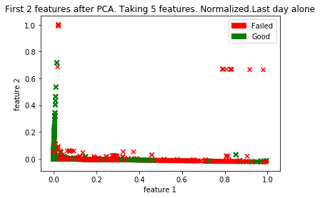

#### CS 7461 Project 21: [Akarshit Wal](https://github.com/Akarshit), [Gnanaguruparan Aishvaryaadevi](https://github.com/Aishvaryaa), [Karthik Nama Anil](https://github.com/KarthikNA), [Parth Tamane](https://github.com/parthv21), [Vaishnavi Kannan](https://github.com/Vaishnavik22)  

<p align="center">
    
</p>

# Introduction
Hard disk failures can be catastrophic in large scale data centers leading to potential loss of all data. To alleviate the
impact of such failures, companies are actively looking at ways to predict disk failures and take preemptive measures.
Traditional threshold-based algorithms were successful in predicting drive failures only 3-10% of the times[1]. Thus,
we saw a shift to learning based algorithms that use Self-Monitoring, Analysis and Reporting Technology (S.M.A.R.T)
attributes to make predictions. These attributes are different hard drive reliability indicators of an imminent failure.
In recent times, people have applied insights and learnings obtained from analysing hard drives of one vendor to other
vendor using transfer learning techniques[2]. These models either used drives from specific vendors to achieve high
F score[2] or used a subset of data and selected attributes[3]. In this project, we have explored unsupervised and
supervised learning techniques to predict and analyze hard drive crashes. The objective of using both supervised and
unsupervised algorithms is to make a comparison between them.
If companies are able to predict failure of their hard-drives, it would save them tons of money and help them gain customer trust.
Admittedly there are cases where the disk failure cannot be predicted, like electricity failure in the server, natural hazard etc. But most of the hardware failure doesn't happen overnight. A hard-disk starts to show reduced performance in some of the attributes before failing. Recognizing these attributes and training a machine learning model to predict failure based on these attributes is the goal of the project.

# Motivation

# Problem Statement

The problem is to predict when a disk is going to fail. To form this prediction, we are given the S.M.A.R.T attributes of hark-disks along with the date they were collected on. We have fed these attributes to our machine learning algorithms and predicted the results.
We have also compared difference machine learning algorithms and their accuracy on the same dataset. This has helped us formulate which algorithms better suit the dataset and also achive better results.

# Dataset

Backblaze owns and operates multiple data centres that have thousands of hard disk drives. 
They regularly share data about the performance of these drives as well other insights from their datacenters. 

<p align="center">
    
</p>

Every disk drive includes Self-Monitoring, Analysis, and Reporting Technology (S.M.A.R.T), 
which reports internal information about the drive and its primary function is to detect 
as well as report multiple indicators of hard disk drive reliability with the intent of anticipating 
imminent hardware failures.

Backblaze takes a snapshot of each operational hard drive daily and the data includes drive’s serial number, model number, disk capacity, 
a label indicating disk failure, and S.M.A.R.T stats.  

Data for the project was collected from January 1st, 2019 to December 31st, 2019 and data was in 365 CSV files
with each representing one day of the year. Each file has 129 columns. 62 S.M.A.R.T statistics is represented both as 
raw values as well as normalised values(a total of 124 columns). The other columns provide information about the hard disk and the date of the record.

The dataset can be downloaded [here](https://www.backblaze.com/b2/hard-drive-test-data.html).


# Methodology
The data obtained from Backblaze was aggregated and cleaned using different techniques. 
Relevant features were determined for further analysis. A combination of supervised and unsupervised learning
techniques were adopted to predict the failure of a hard disk drive from S.M.A.R.T statistics and 
cluster hard drives based on S.M.A.R.T statistics. The results were further analysed and visualised.

<p align="center">
    
</p>


## Data Cleaning

We observed that different hard disks showed significantly different behaviour at the time 
of failure. Additionally, we identified different S.M.A.R.T statistics were needed to identify 
the failure of each hard disk model. Thus, we selected the hard disk models that failed the most 
in the dataset. Thus, we were concentrating the predicting the hard disks that failed the most. 
We determined the top 5 hard disks that failed the maximum number of times in the dataset.

<p align="center">
    
</p>

We observed that ST12000NM0007 was the most used hard disk in the dataset and at the same 
time, the one that failed the most in the dataset. It had more than twice the number of 
failures than any other hard disk in the dataset. 
The image below shows the five hard disks we shortlisted for further analysis.

<p align="center">
    
</p>

<p align="center">
    
</p>

## Feature Selection

## Supervised Learning

We approached the task of predicting hard disk failures using Supervised as well as Unsupervised Learning algorithms.

The dataset used for both the algorithms is the Backblaze dataset which composes of S.M.A.R.T attributes corresponding to the hard drives. Since the meaning and range of values of the same  S.M.A.R.T attributes can change across models, we decided to create a separate classifier for predicting failures of each hard disk model.

One of the major challenges we faced was the class imbalance problem where we have significantly less number of records for failed disks when compared to those that did not fail. This is primarily because failure of a hard disk is a rare event given its life span. The label for the failed disk is marked as 1 only on the day of its failure and then removed from the dataset.

The most logical approach to address this class imbalance problem was to make the data for both the classes comparable. At first, we used the data for hard disk ST12000NM0007 in the first quarter of 2019 by modifying the label for last 10 days of a failed hard disk to 1. Even with this approach, we had 2946617 rows for disks that did not fail and 1725 rows for those that failed. 

As shown in table 1, lthough accuracy of prediction in this case was high, recall however was extremely low (0.05) rendering this model ineffective in making good predictions. In the problem of disk failure detection, we require a high recall as it aims to identify what proportion of actual positives was identified correctly. This is most important to us as we wouldn't want to miss predicting a  possible failure event. 

So we decided to limit our scope to last 10 days of a hard disks life for both good and failing drives. This showed us improvements in terms of recall and hence we tried two techniques to augment data for the failaing drives -  1) SMOTE and 2) Random resampling with replacement.

What we observed empirically and was confirmed by other researchers is that SMOTE does not work well when the dimensionality of data is large[6].So we decided to use the resample function from sklearn and upsample only the training data for failed hard disks. This technique helped us achieve significantly better results as shown in Table 2. We also tried to downsample the good drives data to match the number failed drive records, but this produced too less training data set and did not really work well. Now that we had our base data ready, next came the task of parameter tuning. We used GridSearchCV to tune XGBoost and RandomizedSearchCV for tuning RandomForest. In both cases, f1 score was used as the metric to tune the model on.

We took a similar approach for unsupervised learning as well. Realizing that the task of hard disk prediction resembles anamoly detection giveen the nature of the dataset, we used the Isolation Forest anamoly detecttion algorithm and tuned parameters to create a model that is capable of making good predictions.

One important point to note in both the learning algorithms is that since we're dealing with timeseries data, we used the most recent 30% of the dataset for testing and the remaining 70% for training without shuffling the data.

## Unsupervised Learning

We wanted to analyze if clustering algorithms can result in two clusters – good hard drives and those that failed. 

Model tested for: ST12000NM0007 
Data set: Last recorded entry for each drive

We reduced to two features using PCA, for visualization. 

<p align="center">
    
</p>

Since there are no distinct clusters of good and failed drives, applying K-Means to this data set did not give accurate results. Resampling the dataset did not help. So we decided to use clustering algorithms (DBSCAN, K-Means) to cluster into models based on SMART attributes. As stated earlier, since many SMART attributes do not have uniform meaning across manufacturers, we decided to use only those attributes that are present across all models. These are SMART attribute numbers 5,187,188,197,198.

Models: ST8000DM002, ST8000NM0055, ST12000NM0007, ST4000DM000
Data set: Last recorded entry for each drive

We again applied PCA on these five attributes and reduced them to two attributes.

<p align="center">
    
</p>

We realized that clustering algorithms will not be able to produce distinct clusters based on these five attributes alone. Our results confirmed this. Resampling was also not helpful because the values of the features do not change. Thus, we analyzed the dataset to find another feature that was present across all models. Capacity of the hard disk satisfied this criterion. 

Performing PCA on these six attributes and reducing them to two attributes, we got: 

<p align="center">
    
</p>

### DBSCAN
We used grid search on the minimum number of neighbors in the DBSCAN algorithm. This gave an accuracy of 83.87%

### K-Means
Elbow method to find number of clusters:

<p align="center">
    
</p>

As observed in PCA, the elbow method gave k=3. But we ran for k=4, since we know that there are 4 models. This gave an accuracy of 88.23%.

From above, it is evident that clustering algorithms cannot be used for predicting if the hard drive will fail. However, along with capacity it could be used to predict which model a hard drive is.

# What's new in our approach?

Since the Backblaze data already has class labels indicating whether a disk has failed or not, this dataset is well-suited for supervised learning. All prior notable works focus on building a classifier that can make accurate predictions. We however attempt to solve the same problem using unsupervised learning as well. Although there have been works that make use of unsupervised learning to augment data and tackle the class imbalance problem, to the best of our knowledge, we are the first to apply principles of anamoly detection on the Backblaze dataset to predict failure events.

# Results

##### Table 1 : Random Forest results on original dataset for the 1st quarter of 2019

>Accuracy:  0.9994109693116142

|labels|precision|recall|f1-score | 
|------|---------|------|---------|
|0     |1.00     |1.00  |1.00     |
|1     |0.47     |0.05  |0.08     |


##### Table 2 : Random Forest results after up-sampling data for the 1st quarter of 2019

> Accuracy:  0.9948433919022154

|labels|precision|recall|f1-score | 
|------|---------|------|---------|
|0     |1.00     |1.00  |1.00     |
|1     |0.50     |0.15  |0.23     |

##### Table 3 :  Random Forest results post parameter tuning


<!-- Parameters:
```
{
    'n_estimators': 2000, 
    'min_samples_split': 5, 
    'min_samples_leaf': 4, 
    'max_features': 'auto', 
    'max_depth': 40, 
    'criterion': 'entropy', 
    'bootstrap': True
}
``` -->

<table class="tg">
  <tr>
    <th class="tg-0pky">Model</th>
    <th class="tg-c3ow">Accuracy</th>
    <th class="tg-c3ow">Label</th>
    <th class="tg-c3ow">Precision</th>
    <th class="tg-c3ow">Recall</th>
    <th class="tg-c3ow">F1</th>
    <th class="tg-0lax">Support</th>
  </tr>
  
  <tr>
    <td class="tg-0pky" rowspan="2">ST12000NM0007</td>
    <td class="tg-c3ow" rowspan="2">0.9997123</td>
    <td class="tg-baqh">0</td>
    <td class="tg-baqh">1</td>
    <td class="tg-baqh">1</td>
    <td class="tg-baqh">1</td>
    <td class="tg-0lax">74210</td>
  </tr>
  <tr>
    <td class="tg-baqh">1</td>
    <td class="tg-baqh">0.99</td>
    <td class="tg-baqh">1</td>
    <td class="tg-baqh">1</td>
    <td class="tg-0lax">2252</td>
  </tr>
  
  <tr>
    <td class="tg-0pky" rowspan="2">ST4000DM000</td>
    <td class="tg-c3ow" rowspan="2">0.9999358</td>
    <td class="tg-baqh">0</td>
    <td class="tg-baqh">1</td>
    <td class="tg-baqh">1</td>
    <td class="tg-baqh">1</td>
    <td class="tg-0lax">45926</td>
  </tr>
  <tr>
    <td class="tg-baqh">1</td>
    <td class="tg-baqh">1</td>
    <td class="tg-baqh">1</td>
    <td class="tg-baqh">1</td>
    <td class="tg-0lax">794</td>
  </tr>

   <tr>
    <td class="tg-0pky" rowspan="2">ST8000NM0055</td>
    <td class="tg-c3ow" rowspan="2">1</td>
    <td class="tg-baqh">0</td>
    <td class="tg-baqh">1</td>
    <td class="tg-baqh">1</td>
    <td class="tg-baqh">1</td>
    <td class="tg-0lax">28906</td>
  </tr>
  <tr>
    <td class="tg-baqh">1</td>
    <td class="tg-baqh">1</td>
    <td class="tg-baqh">1</td>
    <td class="tg-baqh">1</td>
    <td class="tg-0lax">436</td>
  </tr>
  
  
  <tr>
    <td class="tg-0pky" rowspan="2">ST8000DM002</td>
    <td class="tg-c3ow" rowspan="2">1</td>
    <td class="tg-baqh">0</td>
    <td class="tg-baqh">1</td>
    <td class="tg-baqh">1</td>
    <td class="tg-baqh">1</td>
    <td class="tg-0lax">19627</td>
  </tr>
  <tr>
    <td class="tg-baqh">1</td>
    <td class="tg-baqh">1</td>
    <td class="tg-baqh">1</td>
    <td class="tg-baqh">1</td>
    <td class="tg-0lax">239</td>
  </tr>
  
  <tr>
    <td class="tg-0pky" rowspan="2">TOSHIBA MQ01ABF050 </td>
    <td class="tg-c3ow" rowspan="2">0.9990637</td>
    <td class="tg-baqh">0</td>
    <td class="tg-baqh">1</td>
    <td class="tg-baqh">1</td>
    <td class="tg-baqh">1</td>
    <td class="tg-0lax">912</td>
  </tr>
  <tr>
    <td class="tg-baqh">1</td>
    <td class="tg-baqh">0.99</td>
    <td class="tg-baqh">1</td>
    <td class="tg-baqh">1</td>
    <td class="tg-0lax">156</td>
  </tr>

</table>


##### Table 4 :  XGBoost classifier results post parameter tuning

<!-- Paramteres:
```
{ 
    learning_rate: 0.2,
    n_estimators: 1251,
    max_depth: 3,
    min_child_weight: 3,
    gamma: 0.1,
    reg_alpha: 0.01,
    subsample: 0.8,
    colsample_bytree: 0.8,
    objective: 'binary:logistic',
    scale_pos_weight: 1,
    seed: 27)
} 
``` -->

<table class="tg">
  <tr>
    <th class="tg-0pky">Model</th>
    <th class="tg-c3ow">Accuracy</th>
    <th class="tg-c3ow">Label</th>
    <th class="tg-c3ow">Precision</th>
    <th class="tg-c3ow">Recall</th>
    <th class="tg-c3ow">F1</th>
    <th class="tg-0lax">Support</th>
  </tr>
  
  <tr>
    <td class="tg-0pky" rowspan="2">ST12000NM0007</td>
    <td class="tg-c3ow" rowspan="2"> 0.9922837</td>
    <td class="tg-baqh">0</td>
    <td class="tg-baqh">1</td>
    <td class="tg-baqh"> 0.99</td>
    <td class="tg-baqh">1</td>
    <td class="tg-0lax">74210</td>
  </tr>
  <tr>
    <td class="tg-baqh">1</td>
    <td class="tg-baqh">0.79</td>
    <td class="tg-baqh">1</td>
    <td class="tg-baqh">0.88</td>
    <td class="tg-0lax">2252</td>
  </tr>
  
  <tr>
    <td class="tg-0pky" rowspan="2">ST4000DM000</td>
    <td class="tg-c3ow" rowspan="2">0.9991438</td>
    <td class="tg-baqh">0</td>
    <td class="tg-baqh">1</td>
    <td class="tg-baqh">1</td>
    <td class="tg-baqh">1</td>
    <td class="tg-0lax">45926</td>
  </tr>
  <tr>
    <td class="tg-baqh">1</td>
    <td class="tg-baqh">0.95</td>
    <td class="tg-baqh">1</td>
    <td class="tg-baqh">0.98</td>
    <td class="tg-0lax">794</td>
  </tr>
  
   <tr>
    <td class="tg-0pky" rowspan="2">ST8000NM0055</td>
    <td class="tg-c3ow" rowspan="2"> 0.9999659</td>
    <td class="tg-baqh">0</td>
    <td class="tg-baqh">1</td>
    <td class="tg-baqh">1</td>
    <td class="tg-baqh">1</td>
    <td class="tg-0lax">28906</td>
  </tr>
  <tr>
    <td class="tg-baqh">1</td>
    <td class="tg-baqh">1</td>
    <td class="tg-baqh">1</td>
    <td class="tg-baqh">1</td>
    <td class="tg-0lax">436</td>
  </tr>  
  
  <tr>
    <td class="tg-0pky" rowspan="2">ST8000DM002</td>
    <td class="tg-c3ow" rowspan="2">1</td>
    <td class="tg-baqh">0</td>
    <td class="tg-baqh">1</td>
    <td class="tg-baqh">1</td>
    <td class="tg-baqh">1</td>
    <td class="tg-0lax">19627</td>
  </tr>
  <tr>
    <td class="tg-baqh">1</td>
    <td class="tg-baqh">1</td>
    <td class="tg-baqh">1</td>
    <td class="tg-baqh">1</td>
    <td class="tg-0lax">239</td>
  </tr>
  
   <tr>
    <td class="tg-0pky" rowspan="2">TOSHIBA MQ01ABF050 </td>
    <td class="tg-c3ow" rowspan="2">1</td>
    <td class="tg-baqh">0</td>
    <td class="tg-baqh">1</td>
    <td class="tg-baqh">1</td>
    <td class="tg-baqh">1</td>
    <td class="tg-0lax">912</td>
  </tr>
  <tr>
    <td class="tg-baqh">1</td>
    <td class="tg-baqh">1</td>
    <td class="tg-baqh">1</td>
    <td class="tg-baqh">1</td>
    <td class="tg-0lax">156</td>
  </tr>
 
</table>


### Isolation Forest


<table class="tg">
  <tr>
    <th class="tg-0pky">Model</th>
    <th class="tg-c3ow">Accuracy</th>
    <th class="tg-c3ow">Label</th>
    <th class="tg-c3ow">Precision</th>
    <th class="tg-c3ow">Recall</th>
    <th class="tg-c3ow">F1</th>
    <th class="tg-0lax">Support</th>
  </tr>
  
  <tr>
    <td class="tg-0pky" rowspan="2">ST12000NM0007</td>
    <td class="tg-c3ow" rowspan="2"> 0.9997122</td>
    <td class="tg-baqh">0</td>
    <td class="tg-baqh">1</td>
    <td class="tg-baqh">1</td>
    <td class="tg-baqh">1</td>
    <td class="tg-0lax">74210</td>
  </tr>
  <tr>
    <td class="tg-baqh">1</td>
    <td class="tg-baqh">0.99</td>
    <td class="tg-baqh">1</td>
    <td class="tg-baqh">1</td>
    <td class="tg-0lax">2252</td>
  </tr>
  
  <tr>
    <td class="tg-0pky" rowspan="2">ST4000DM000</td>
    <td class="tg-c3ow" rowspan="2">0.9999357</td>
    <td class="tg-baqh">0</td>
    <td class="tg-baqh">1</td>
    <td class="tg-baqh">1</td>
    <td class="tg-baqh">1</td>
    <td class="tg-0lax">45926</td>
  </tr>
  <tr>
    <td class="tg-baqh">1</td>
    <td class="tg-baqh">1</td>
    <td class="tg-baqh">1</td>
    <td class="tg-baqh">1</td>
    <td class="tg-0lax">794</td>
  </tr>
  
  <tr>
    <td class="tg-0pky" rowspan="2">ST8000NM0055</td>
    <td class="tg-c3ow" rowspan="2"> 1</td>
    <td class="tg-baqh">0</td>
    <td class="tg-baqh">1</td>
    <td class="tg-baqh">1</td>
    <td class="tg-baqh">1</td>
    <td class="tg-0lax">28906</td>
  </tr>
  <tr>
    <td class="tg-baqh">1</td>
    <td class="tg-baqh">1</td>
    <td class="tg-baqh">1</td>
    <td class="tg-baqh">1</td>
    <td class="tg-0lax">436</td>
  </tr>
  
  <tr>
    <td class="tg-0pky" rowspan="2">ST8000DM002</td>
    <td class="tg-c3ow" rowspan="2">1</td>
    <td class="tg-baqh">0</td>
    <td class="tg-baqh">1</td>
    <td class="tg-baqh">1</td>
    <td class="tg-baqh">1</td>
    <td class="tg-0lax">19627</td>
  </tr>
  <tr>
    <td class="tg-baqh">1</td>
    <td class="tg-baqh">1</td>
    <td class="tg-baqh">1</td>
    <td class="tg-baqh">1</td>
    <td class="tg-0lax">239</td>
  </tr>  
  
  <tr>
    <td class="tg-0pky" rowspan="2">TOSHIBA MQ01ABF050 </td>
    <td class="tg-c3ow" rowspan="2">0.9990636</td>
    <td class="tg-baqh">0</td>
    <td class="tg-baqh">1</td>
    <td class="tg-baqh">1</td>
    <td class="tg-baqh">1</td>
    <td class="tg-0lax">912</td>
  </tr>
  <tr>
    <td class="tg-baqh">1</td>
    <td class="tg-baqh">0.99</td>
    <td class="tg-baqh">1</td>
    <td class="tg-baqh">1</td>
    <td class="tg-0lax">156</td>
  </tr>
  
</table>


# Conclusion


# Future Work
We suspect that our models are overfit on cases where there were very few hard disk failures i.e. TOSHIBA MQ01ABF050, ST8000DM002. In future we hope to train on a larger data set, thereby reducing over fitting. We also would like to explore the possibility of creating a generic classifier for all hard disk models. 


# References
1. C. Xu, G. Wang, X. Liu, D. Guo, and T. Liu. Health status assessment and failure prediction for hard drives with recurrent neural networks. IEEE Transactions on Computers, 65(11):3502–3508, Nov 2016.
2. Mirela Madalina Botezatu, Ioana Giurgiu, Jasmina Bogojeska, and Dorothea Wiesmann. Predicting disk re- placement towards reliable data centers. In Proceedings of the 22nd ACM SIGKDD International Conference on Knowledge Discovery and Data Mining, 2016.
3. Jing Shen, Jian Wan, Se-Jung Lim, and Lifeng Yu. Random-forest-based failure prediction for hard disk drives. International Journal of Distributed Sensor Networks, 14(11):1550147718806480, 2018.
4. Backblaze. Backblaze hard drive state, 2020.
5. J. Li et al. Hard drive failure prediction using classification and regression trees. In 44th Annual IEEE/IFIP International Conference on Dependable Systems and Networks, Atlanta, GA, 2014, 2014.
6. Blagus, R., Lusa, L. SMOTE for high-dimensional class-imbalanced data. BMC Bioinformatics 14, 106 (2013)

----

Dataset = [Hard Drive Data and Stats - Hard drive failure data and stats from 2019](https://www.kaggle.com/jackywangkaggle/hard-drive-data-and-stats)

Source = [Hard Drive Data and Stats](https://www.backblaze.com/b2/hard-drive-test-data.html)

# Smart Stats List

[List of all S.M.A.R.T. Attributes Including Vendor Specific](https://www.data-medics.com/forum/list-of-all-s-m-a-r-t-attributes-including-vendor-specific-t1476.html)

[List of Public SMART Attributes](http://www.t13.org/Documents/UploadedDocuments/docs2005/e05173r0-ACS-SMARTAttributes_List.pdf)

[Western Digital SMART attributes](https://sourceforge.net/p/smartmontools/mailman/message/23829511/)

